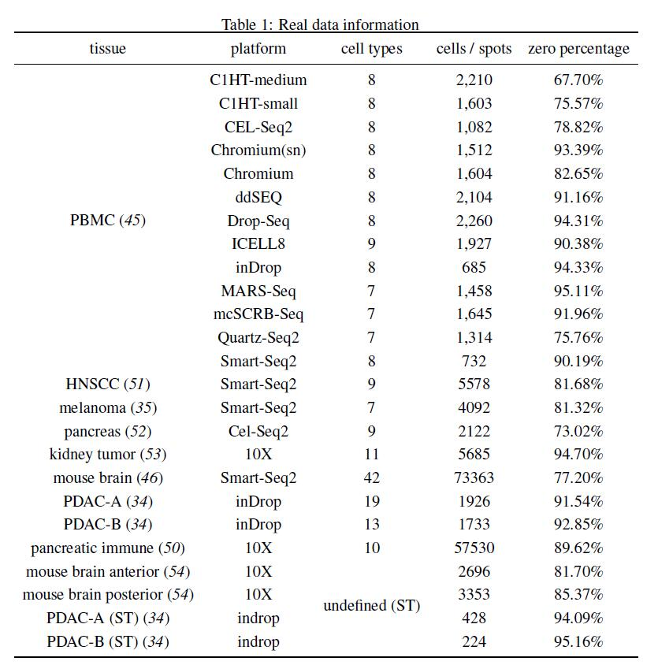

# SSLAR:Deconvoluting spatial transcriptomics data with single-cell transcriptomes through semi-supervised NMF and least angle regression

SSLAR conducted cell type annotation by leveraging single cell RNA sequencing and spatial transcriptomics data via machine learning.


## Data

All the data used in this article is shown below:



We provide a dataset for PBMC(smart-seq) as an example.

## System Requirements

Install python3.6 for running ssNMF. And these packages should be satisfied:

ssnmf~=1.0.3

scikit-learn~=0.23.1

torch~=1.10.2

nltk==3.5

scipy==1.4.1

matplotlib==3.2.2

numpy~=1.19.5

Install R for running SSLAR. And these R packages should be satisfied:

Seurat

lars

spotlight-0.1.7

## Download and configure

```python
git clone https://github.com/plhhnu/SSLAR
cd SSLAR
pip install -r requirements.txt
```

## Run in PBMC(smart-seq)

```r
cd SSLAR
R
source("R/test.R")
```